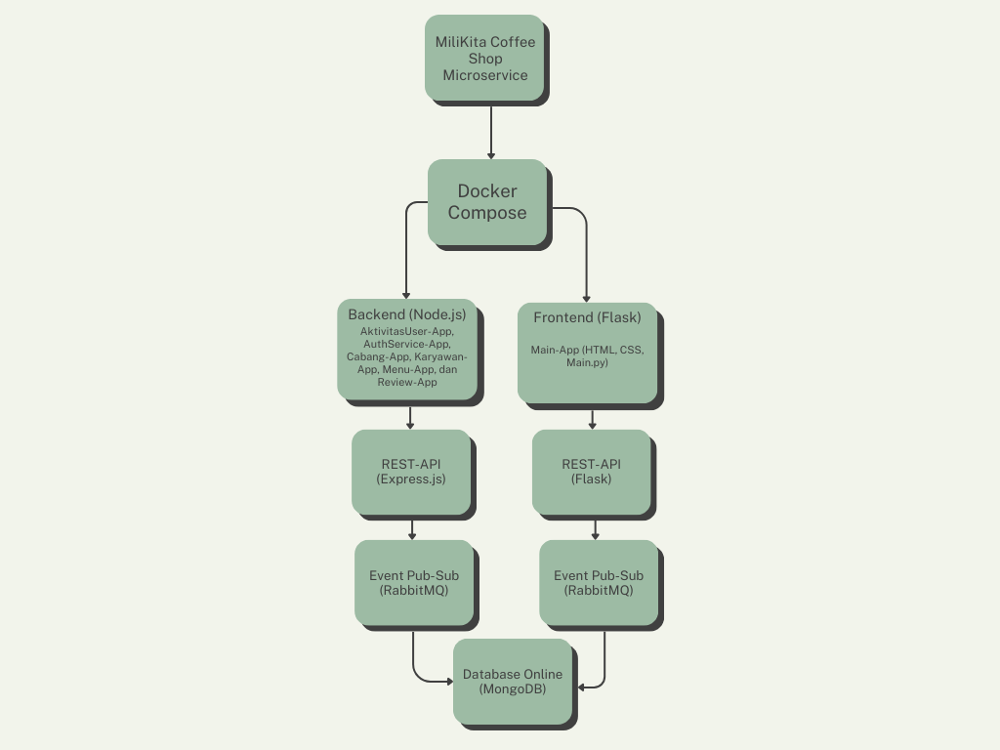

<p align="center"></p>

# Tentang MiliKita

🍵 MiliKita adalah website coffee shop berbasis microservice yang dirancang untuk memudahkan pemilik dalam mengelola berbagai aspek dari bisnis mereka, termasuk cabang, karyawan, menu, ulasan, dan aktivitas di dalam website.

# Workflow


# Anggota Kelompok 3 SI4502

| No  | Nama                                                            | NIM        |
| --- | --------------------------------------------------------------- | ---------- |
| 1   | [Inggit Yeira Budi Agranata](https://www.instagram.com/inggityrba)    | 1202213238 |
| 2   | [Laura Tsanaullailla](https://www.instagram.com/lauratsna)             | 1202210076 |
| 3   | [Nadya Sri Andriani](https://www.instagram.com/nadyasaaa__) | 1202213060 |
| 4   | [Nikita Gradiana Shahiesa](https://www.instagram.com/nikitagradianas)     | 1202213312

# Cara Instalasi dan Penggunaan
| Langkah       | Perintah                                                                                                 | Deskripsi                                                                                                 |
|---------------|----------------------------------------------------------------------------------------------------------|-----------------------------------------------------------------------------------------------------------|
| 1. Clone Repo | ```bash git clone https://github.com/inggityeira/MiliKita-App```                                         | Mengkloning repository MiliKita-App dari GitHub ke mesin lokal Anda                                       |
| 2. Install Dependencies |                                                                                                  |                                                                                                           |
| a. Install Flask     | ```bash pip install flask```                                                                     | Flask adalah sebuah microframework untuk membangun aplikasi web dengan Python                             |
| b. Install PyJWT     | ```bash pip install pyjwt```                                                                     | PyJWT adalah pustaka untuk bekerja dengan JSON Web Tokens (JWT) di Python                                 |
| c. Install Flask-Paginate | ```bash pip install flask-paginate```                                                       | Flask-Paginate adalah pustaka untuk menambahkan fitur paginasi pada aplikasi web yang dibangun dengan Flask|
| 3. Jalankan Aplikasi |                                                                                                    |                                                                                                           |
| a. Docker Compose    | ```bash docker-compose up --build```                                                             | Perintah ini digunakan dalam Docker Compose untuk menjalankan dan membangun kembali layanan-layanan yang ada dalam berkas docker-compose.yml |
| b. Jalankan Python   | ```bash python main.py```                                                                        | Perintah ini digunakan untuk menjalankan program Python yang ada di dalam berkas main.py                   |


# Fitur MiliKita
| Fitur                    | Deskripsi                                                                                                     |
|--------------------------|---------------------------------------------------------------------------------------------------------------|
| **Manajemen Cabang**     | - Menambah, mengedit, dan menghapus cabang MiliKita<br>- Melihat informasi lengkap setiap cabang (nama, lokasi, telpon, dan gambar cabang)       |
| **Manajemen Karyawan**   | - Menambah, mengedit, dan menghapus karyawan MiliKita<br>- Melihat informasi lengkap setiap karyawan (nama, posisi, telpon, dan gambar karyawan)  |
| **Manajemen Menu**       | - Menambah, mengedit, dan menghapus Menu MiliKita<br>- Melihat informasi lengkap setiap menu (nama menu, deskripsi menu, kategori menu, dan gambar menu)  |
| **Manajemen Review**     | - Menambah, mengedit, dan menghapus review MiliKita<br>- Melihat informasi dari seluruh review (pesan review dari setiap cabang dan menu serta bintang review) |
| **Manajemen Aktivitas User** | - Memantau aktivitas yang dilakukan ketika membuka website<br>- Memvisualisasikan dalam bentuk chart aktivitas dari user                             |

# Endpoints

| Service     | HTTP Method | Endpoint                                                   | Deskripsi                                                           |
|-------------|-------------|------------------------------------------------------------|---------------------------------------------------------------------|
| Aktivitas   | GET         | http://localhost:5004/AllAktivitas                         | Mendapatkan semua aktivitas pengguna                                |
| AuthService | POST        | http://localhost:5005/register                             | Mendaftar pengguna baru                                             |
| AuthService | POST        | http://localhost:5005/login                                | Login pengguna                                                      |
| AuthService | GET         | http://localhost:5005/ownerkita                            | Mendapatkan detail pengguna saat ini                                |
| AuthService | PUT         | http://localhost:5005/logout                               | Logout pengguna                                                     |
| Cabang      | POST        | http://localhost:5002/cabangs                              | Membuat cabang baru                                                 |
| Cabang      | GET         | http://localhost:5002/cabang                               | Mendapatkan detail semua cabang                                     |
| Cabang      | GET         | http://localhost:5002/cabangs/{id_cabang}                  | Mendapatkan detail cabang tertentu berdasarkan ID                   |
| Cabang      | GET         | http://localhost:5002/cabangs/kota/{kota_cabang}           | Mendapatkan detail cabang di kota tertentu                          |
| Cabang      | PUT         | http://localhost:5002/cabangs/{id_cabang}                  | Memperbarui cabang tertentu berdasarkan ID                          |
| Cabang      | DELETE      | http://localhost:5002/cabangs/{id_cabang}                  | Menghapus cabang tertentu berdasarkan ID                            |
| Karyawan    | POST        | http://localhost:5003/karyawankita                         | Membuat karyawan baru                                               |
| Karyawan    | GET         | http://localhost:5003/karyawanskita                        | Mendapatkan detail semua karyawan                                   |
| Karyawan    | GET         | http://localhost:5003/karyawankita/{id_karyawan}           | Mendapatkan detail karyawan tertentu berdasarkan ID                 |
| Karyawan    | GET         | http://localhost:5003/karyawankita/Posisi/{posisi_karyawan}| Mendapatkan detail karyawan berdasarkan posisi                      |
| Karyawan    | GET         | http://localhost:5003/karyawankita/Cabang/{id_karyawan}    | Mendapatkan detail karyawan berdasarkan ID cabang                   |
| Karyawan    | PUT         | http://localhost:5003/karyawankita/{id_karyawan}           | Memperbarui karyawan tertentu berdasarkan ID                        |
| Karyawan    | DELETE      | http://localhost:5003/karyawankita/{id_karyawan}           | Menghapus karyawan tertentu berdasarkan ID                          |
| Menu        | POST        | http://localhost:5001/menuMiliKita                         | Membuat item menu baru                                              |
| Menu        | GET         | http://localhost:5001/menusMiliKita                        | Mendapatkan detail semua item menu                                  |
| Menu        | GET         | http://localhost:5001/menuMiliKita/{id_menu}               | Mendapatkan detail item menu tertentu berdasarkan ID                |
| Menu        | GET         | http://localhost:5001/kategori/menuMiliKita/kategori/{kategori_menu}| Mendapatkan detail item menu berdasarkan kategori          |
| Menu        | GET         | http://localhost:5001/menuMiliKita/posisi/{posisi_karyawan}| Mendapatkan detail item menu berdasarkan posisi                     |
| Menu        | PUT         | http://localhost:5001/menuMiliKita/{id_menu}               | Memperbarui item menu tertentu berdasarkan ID                       |
| Menu        | DELETE      | http://localhost:5001/menuMiliKita/{id_menu}               | Menghapus item menu tertentu berdasarkan ID                         |
| Review      | POST        | http://localhost:5000/review                               | Membuat ulasan baru                                                 |
| Review      | GET         | http://localhost:5000/reviews                              | Mendapatkan detail semua ulasan                                     |
| Review      | GET         | http://localhost:5000/reviews/{id_review}                  | Mendapatkan detail ulasan tertentu berdasarkan ID                   |
| Review      | GET         | http://localhost:5000/reviews/cabang/{id_cabang}           | Mendapatkan detail ulasan berdasarkan ID cabang                     |
| Review      | GET         | http://localhost:5000/reviews/menu/{id_menu}               | Mendapatkan detail ulasan berdasarkan ID menu                       |
| Review      | PUT         | http://localhost:5000/reviews/{id_review}                  | Memperbarui ulasan tertentu berdasarkan ID                          |
| Review      | DELETE      | http://localhost:5000/reviews/{id_review}                  | Menghapus ulasan tertentu berdasarkan ID                            |
| MainApp     | GET         | http://localhost:5010/                                     | Halaman utama aplikasi                                              |
| MainApp     | GET         | http://localhost:5010/home                                 | Halaman beranda aplikasi                                            |
| MainApp     | GET         | http://localhost:5010/register                             | Halaman pendaftaran                                                 |
| MainApp     | POST        | http://localhost:5010/register                             | Mengirim detail pendaftaran                                         |
| MainApp     | GET         | http://localhost:5010/loginUserKita                        | Halaman login                                                       |
| MainApp     | POST        | http://localhost:5010/login                                | Mengirim detail login                                               |
| MainApp     | GET         | http://localhost:5010/logout                               | Halaman logout                                                      |
| MainApp     | GET         | http://localhost:5010/cabang                               | Halaman cabang                                                      |
| MainApp     | GET         | http://localhost:5010/cabangByID/{id_cabang}               | Halaman detail cabang                                               |
| MainApp     | GET         | http://localhost:5010/editCabang/{id_cabang}               | Halaman edit cabang                                                 |
| MainApp     | POST        | http://localhost:5010/editCabang/{id_cabang}               | Mengirim detail cabang yang sudah diedit                            |
| MainApp     | GET         | http://localhost:5010/cabangs                              | Halaman membuat cabang baru                                         |
| MainApp     | POST        | http://localhost:5010/cabangs                              | Mengirim detail cabang baru                                         |
| MainApp     | GET         | http://localhost:5010/deleteCabang/{id_cabang}             | Halaman menghapus cabang                                            |
| MainApp     | GET         | http://localhost:5010/listMenuMilikita                     | Halaman daftar item menu                                            |
| MainApp     | GET         | http://localhost:5010/menuByID/{id_menu}                   | Halaman detail item menu                                            |
| MainApp     | GET         | http://localhost:5010/editMenu/{id_menu}                   | Halaman edit item menu                                              |
| MainApp     | POST        | http://localhost:5010/editMenu/{id_menu}                   | Mengirim detail item menu yang sudah diedit                         |
| MainApp     | GET         | http://localhost:5010/menuMiliKita                         | Halaman membuat item menu baru                                      |
| MainApp     | POST        | http://localhost:5010/menuMiliKita                         | Mengirim detail item menu baru                                      |
| MainApp     | GET         | http://localhost:5010/deleteMenu/{id_menu}                 | Halaman menghapus item menu                                         |
| MainApp     | GET         | http://localhost:5010/officer                              | Halaman daftar karyawan                                             |
| MainApp     | GET         | http://localhost:5010/KaryawanByID/{id_karyawan}           | Halaman detail karyawan                                             |
| MainApp     | GET         | http://localhost:5010/editKaryawan/{id_karyawan}           | Halaman edit karyawan                                               |
| MainApp     | POST        | http://localhost:5010/editKaryawan/{id_karyawan}           | Mengirim detail karyawan yang sudah diedit                          |
| MainApp     | GET         | http://localhost:5010/createOfficer/cabang/{id_cabang}     | Halaman membuat karyawan baru                                       |
| MainApp     | POST        | http://localhost:5010/createOfficer/cabang/{id_cabang}     | Mengirim detail karyawan baru                                       |
| MainApp     | GET         | http://localhost:5010/deleteKaryawan/{id_karyawan}         | Halaman menghapus karyawan                                          |
| MainApp     | GET         | http://localhost:5010/reviews                              | Halaman daftar ulasan                                               |
| MainApp     | GET         | http://localhost:5010/ReviewByID/{id_review}               | Halaman detail ulasan                                               |
| MainApp     | GET         | http://localhost:5010/editReview/{id_review}               | Halaman edit ulasan                                                 |
| MainApp     | POST        | http://localhost:5010/editReview/{id_review}               | Mengirim detail ulasan yang sudah diedit                            |
| MainApp     | GET         | http://localhost:5010/createReview/menu/{id_menu}          | Halaman membuat ulasan baru                                         |
| MainApp     | POST        | http://localhost:5010/createReview/menu/{id_menu}          | Mengirim detail ulasan baru                                         |
| MainApp     | GET         | http://localhost:5010/deleteReview/{id_review}             | Halaman menghapus ulasan                                            |
| MainApp     | GET         | http://localhost:5010/AktivitasUser                        | Halaman daftar aktivitas                                            |
| MainApp     | GET         | http://localhost:5010/chart-data                           | Halaman data grafik aktivitas                                       |
| MainApp     | GET         | http://localhost:5010/chart                                | Halaman grafik aktivitas                                            |
