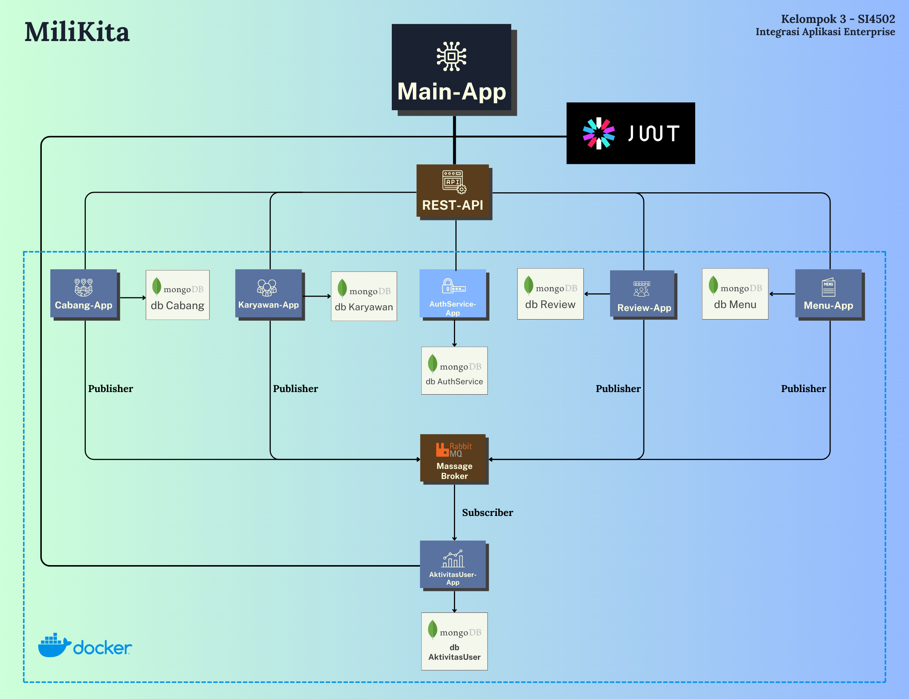

<p align="center"></p>

# Tentang MiliKita

🍵 MiliKita adalah website coffee shop berbasis microservice yang dirancang untuk memudahkan pemilik dalam mengelola berbagai aspek dari bisnis mereka, termasuk cabang, karyawan, menu, ulasan, dan aktivitas di dalam website.

# Workflow


# Anggota Kelompok 3 SI4502

| No  | Nama                                                            | NIM        |
| --- | --------------------------------------------------------------- | ---------- |
| 1   | [Inggit Yeira Budi Agranata](https://www.instagram.com/inggityrba)    | 1202213238 |
| 2   | [Laura Tsanaullailla](https://www.instagram.com/lauratsna)             | 1202210076 |
| 3   | [Nadya Sri Andriani](https://www.instagram.com/nadyasaaa__) | 1202213060 |
| 4   | [Nikita Gradiana Shahiesa](https://www.instagram.com/nikitagradianas)     | 1202213312

# Cara Instalasi dan Penggunaan
1. Clone repository ini:
```bash
git clone https://github.com/SI-RPL-2023/SI-44-06_A_BidjiCourse.git
```
2. Install dependencies:
  Install flask
  Install 
3. Jalankan Aplikasi
Menjalankavn docker-compose up --build
Menjalankan pyhton main.py

# Fitur MiliKita
| Fitur                    | Deskripsi                                                                                                     |
|--------------------------|---------------------------------------------------------------------------------------------------------------|
| **Manajemen Cabang**     | - Menambah, mengedit, dan menghapus cabang MiliKita<br>- Melihat informasi lengkap setiap cabang (nama, lokasi, telpon, dan gambar cabang)       |
| **Manajemen Karyawan**   | - Menambah, mengedit, dan menghapus karyawan MiliKita<br>- Melihat informasi lengkap setiap karyawan (nama, posisi, telpon, dan gambar karyawan)  |
| **Manajemen Menu**       | - Menambah, mengedit, dan menghapus Menu MiliKita<br>- Melihat informasi lengkap setiap menu (nama menu, deskripsi menu, kategori menu, dan gambar menu)  |
| **Manajemen Review**     | - Menambah, mengedit, dan menghapus review MiliKita<br>- Melihat informasi dari seluruh review (pesan review dari setiap cabang dan menu serta bintang review) |
| **Manajemen Aktivitas User** | - Memantau aktivitas yang dilakukan ketika membuka website<br>- Memvisualisasikan dalam bentuk chart aktivitas dari user                             |
